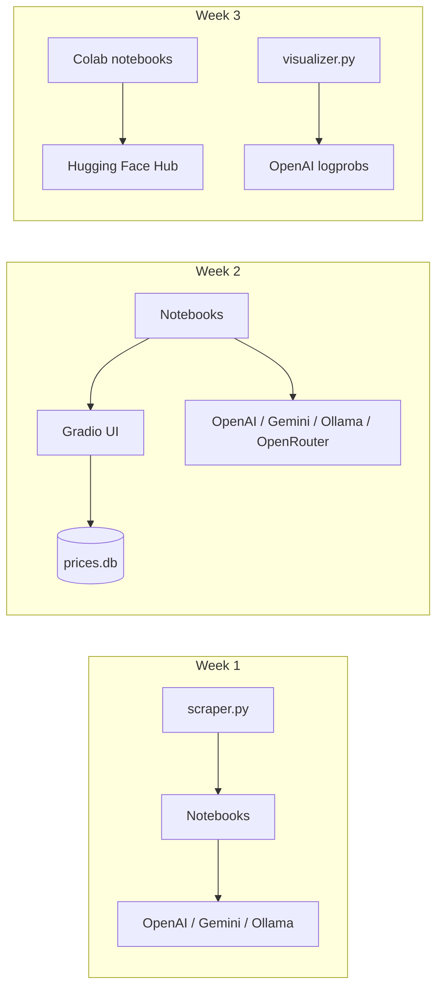

# LLM Engineering Labs

Hands-on Jupyter notebooks and small Python utilities for learning LLM application engineering: multi-provider API clients, web scraping and prompt pipelines, Gradio UIs, tool calling, and open-source Hugging Face model workflows.

This repository is a personal lab workspace organized by week. It is intended for developers studying practical LLM engineering patterns, not as a packaged production application.

## Key features

- **Website summarization and brochure generation** — scrape pages with BeautifulSoup, select relevant links via structured LLM output, and stream markdown company brochures
- **Multi-provider chat clients** — OpenAI, Google Gemini (OpenAI-compatible endpoint), OpenRouter, and local Ollama through a shared `OpenAI()` client pattern; also LangChain and LiteLLM in week 2
- **Gradio applications** — interactive UIs for streaming generation, chat assistants, and a FlightAI demo with function calling
- **Tool calling and persistence** — airline ticket-price tools backed by SQLite (`prices.db`)
- **Multimodal extensions** — image generation and text-to-speech wired into a Gradio chat UI
- **Open-source model labs (Colab/GPU)** — Hugging Face `transformers` / `diffusers` pipelines, tokenizer comparison, quantized causal LM inference, and Whisper-based meeting transcription
- **Token prediction visualization** — stream OpenAI logprobs and render alternatives as a NetworkX/Matplotlib graph

## Architecture overview

Labs are independent notebooks. Shared helpers live next to the week that uses them.



Week 1–2 notebooks are written for a local Python environment with API keys in `.env`. Week 3 notebooks are written primarily for Google Colab (GPU, `userdata` secrets, and Drive mounts) and install some packages inline with `pip`.

## Tech stack

| Area | Technologies in use |
| --- | --- |
| Language / env | Python `>=3.11` (pinned locally to `3.12.12` via `.python-version`), [`uv`](https://github.com/astral-sh/uv) |
| Notebooks | Jupyter / IPython, Gradio |
| LLM APIs | OpenAI Python SDK, Google Generative Language OpenAI-compatible API, OpenRouter, Ollama (`localhost:11434`) |
| Frameworks (declared / used in labs) | LangChain, LiteLLM, Hugging Face `transformers` / `diffusers` / `datasets` |
| Data / scraping | `requests`, BeautifulSoup4, SQLite |
| Visualization | Matplotlib, NetworkX (token graph), Plotly (dependency present) |
| Local / cloud ML | PyTorch, Sentence Transformers, optional Colab GPU (T4-oriented notes) |

`pyproject.toml` also declares additional packages (for example Anthropic, Groq, Chroma, Modal, Weights & Biases) that support a broader course toolchain; the completed notebooks in this repo primarily exercise the stack above.

## Project structure

```text
llm-engineering/
├── pyproject.toml          # Dependencies and project metadata
├── uv.lock                 # Locked dependency versions
├── .python-version         # Local Python version pin
├── .gitignore
├── README.md
├── week-1/                 # Foundations: APIs, scraping, tokenization, brochures
│   ├── scraper.py
│   ├── day_1.ipynb
│   ├── day_2.ipynb
│   ├── day_4.ipynb
│   └── day_5.ipynb
├── week-2/                 # Multi-provider clients, Gradio, tools, multimodal
│   ├── scraper.py
│   ├── prices.db
│   ├── hamlet.txt
│   ├── day_1.ipynb … day_5.ipynb
│   └── extra.ipynb
└── week-3/                 # HF pipelines, tokenizers, transformers, audio project
    ├── visualizer.py
    ├── visualizer.ipynb
    ├── denver_extract.mp3
    └── day_1.ipynb … day_5.ipynb
```

There is no `week-1/day_3.ipynb` in this repository.

## Labs by week

### Week 1 — Foundations

| Notebook | What it covers |
| --- | --- |
| `day_1.ipynb` | Env setup, OpenAI chat completions, scrape + summarize a website to markdown |
| `day_2.ipynb` | Raw `requests` to the OpenAI REST API, SDK usage, Gemini via compatible base URL, Ollama |
| `day_4.ipynb` | Tokenization with `tiktoken` |
| `day_5.ipynb` | Link selection (JSON), multi-page scrape, brochure generation with streaming |

`scraper.py` exposes:

- `fetch_website_contents(url)` — fetch HTML, strip `script`/`style`/`img`/`input`, return title + body text (truncated to 2,000 characters)
- `fetch_website_links(url)` — return non-empty `href` values from the page

### Week 2 — Apps and agents patterns

| Notebook | What it covers |
| --- | --- |
| `day_1.ipynb` | Same OpenAI-compatible client pattern across OpenAI, Gemini, OpenRouter, Ollama; LangChain / LiteLLM samples; long-context experiment with `hamlet.txt` |
| `day_2.ipynb` | Gradio `Interface` basics and a streaming brochure generator UI |
| `day_3.ipynb` | Gradio `ChatInterface`, system prompts, and conversational UX experiments |
| `day_4.ipynb` | FlightAI chat assistant, OpenAI function calling, SQLite-backed ticket prices |
| `day_5.ipynb` | Extends FlightAI with tools plus image generation and TTS in a custom Gradio layout |
| `extra.ipynb` | OpenRouter multi-model generation experiment (imports a local `revealer` helper that is not present in this repo) |

### Week 3 — Open-source models and audio

| Notebook / module | What it covers |
| --- | --- |
| `day_1.ipynb` | GPU check, HF login, SDXL Turbo text-to-image (`diffusers`) |
| `day_2.ipynb` | Hugging Face `pipeline` tasks (sentiment, translation, and related inference notes) |
| `day_3.ipynb` | Tokenizer deep dive (`AutoTokenizer`, chat templates, cross-model comparison) |
| `day_4.ipynb` | Causal LM loading with bitsandbytes quantization, streaming (`TextStreamer`) |
| `day_5.ipynb` | Meeting audio transcription (local Whisper vs OpenAI Whisper API) and LLM-generated minutes / action items |
| `visualizer.py` + `visualizer.ipynb` | Stream token logprobs from OpenAI and plot prediction alternatives |

`denver_extract.mp3` is sample audio for the week 3 meeting-minutes lab. The Colab notebook also references a Google Drive path for the same workflow.

## Prerequisites

- Python 3.11+ (3.12 recommended to match `.python-version`)
- [`uv`](https://docs.astral.sh/uv/) (recommended) or `pip` + `venv`
- API keys as needed for the labs you run (see [Environment variables](#environment-variables))
- Optional:
  - [Ollama](https://ollama.com/) with a local model such as `qwen3:8b` for local inference labs
  - A CUDA GPU or Google Colab runtime for week 3 model notebooks
  - A [Hugging Face](https://huggingface.co/) token for gated models (for example Llama)

## Installation and setup

```bash
git clone https://github.com/raghhavv03/llm-engineering.git
cd llm-engineering
uv sync
```

Activate the environment if you are not using `uv run`:

```bash
source .venv/bin/activate
```

With `pip`:

```bash
python3 -m venv .venv
source .venv/bin/activate
pip install -e .
```

Register a Jupyter kernel if needed:

```bash
python -m ipykernel install --user --name=llm-engineering
```

Then open notebooks under `week-1/`, `week-2/`, or `week-3/` in VS Code, Jupyter Lab, or Colab.

## Environment variables

Create a `.env` file in the repository root (the file is gitignored):

```ini
OPENAI_API_KEY=sk-...
GOOGLE_API_KEY=...
OPENROUTER_API_KEY=sk-or-...
```

| Variable | Used by | Purpose |
| --- | --- | --- |
| `OPENAI_API_KEY` | Weeks 1–2, `visualizer.py`, parts of week 3 | OpenAI Chat Completions, images, TTS, Whisper API |
| `GOOGLE_API_KEY` | Weeks 1–2 | Gemini via OpenAI-compatible base URL |
| `OPENROUTER_API_KEY` | Week 2 (`day_1`, `extra`) | OpenRouter multi-model access |
| `HF_TOKEN` | Week 3 Colab notebooks | Hugging Face Hub login for gated models (via Colab secrets / `userdata`, not the root `.env` in the current notebooks) |

Never commit `.env` or API keys.

## Running the project

There is no single application entrypoint. Run labs as notebooks:

```bash
# from repo root, with the venv active
jupyter lab
# or open individual .ipynb files in your IDE
```

Useful local helpers:

```bash
# Pull a local Ollama model used in several notebooks
ollama pull qwen3:8b

# Token prediction graph (requires OPENAI_API_KEY)
cd week-3
python -c "from visualizer import TokenPredictor, create_token_graph, visualize_predictions; \
p=TokenPredictor('gpt-4.1-mini'); preds=p.predict_tokens('Hello'); \
visualize_predictions(create_token_graph('gpt-4.1-mini', preds)).show()"
```

Week 3 Colab notebooks install pinned packages with `!pip` and expect GPU + HF authentication. Adapt `userdata.get('HF_TOKEN')` / Drive paths if you run them outside Colab.

## How a typical workflow looks

**Brochure pipeline (weeks 1–2):**

1. Fetch links from a company homepage
2. Ask a model to return relevant brochure URLs as JSON
3. Scrape those pages
4. Generate (and optionally stream) a markdown brochure in a notebook or Gradio UI

**FlightAI assistant (week 2):**

1. User chats in Gradio
2. Model may call `get_ticket_price`
3. Price is read from SQLite
4. Optional image / TTS responses enrich the reply

**Meeting minutes (week 3):**

1. Transcribe meeting audio with Whisper (local or API)
2. Prompt an instruct LLM to produce structured minutes and action items

## Design notes

- Labs favor the OpenAI SDK with alternate `base_url` values so Gemini, OpenRouter, and Ollama share one client style
- Scraping is intentionally simple (re-parse HTML for links vs contents) to keep course code readable
- Week 3 focuses on understanding tokenization, model internals, and local inference tradeoffs rather than wrapping a deployable service
- Dependencies in `pyproject.toml` are broader than the notebooks exercised so far; treat unused packages as available tooling, not as evidence of implemented products

## Limitations

- Educational notebooks, not a production service or library API
- No automated test or lint suite is configured in this repository
- `week-2/extra.ipynb` imports `revealer`, which is not included here
- Week 3 notebooks assume Colab APIs (`google.colab`) and often a GPU
- Some notebooks pin package versions via inline `pip` that may differ from `uv.lock`
- Sample credentials or share flags may appear in exploratory Gradio cells; do not reuse them outside local experiments

## Contributing

This is a personal learning repository. If you fork it for your own labs, keep secrets out of git and prefer documenting new weeks with the same day-based notebook layout.

## License

No license file is present in this repository. All rights remain with the author unless a license is added later.
